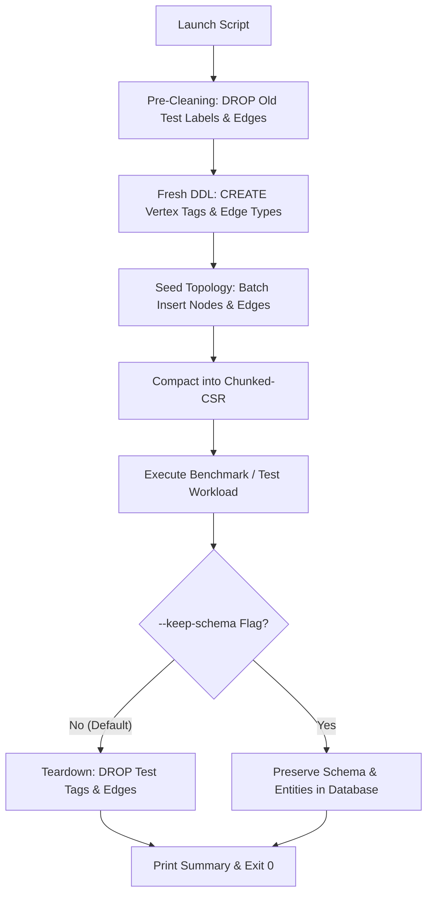

# GDB Testing & Performance Benchmarking Guide

Comprehensive guide to executing stress testing, graph traversal benchmarks, GPU hardware acceleration evaluation, data loading, and mathematical validation for the distributed in-memory graph database **GDB**.

---

## 📑 Table of Contents
1. [Overview & Philosophy](#-overview--philosophy)
2. [Automated Schema Lifecycle](#-automated-schema-lifecycle)
3. [Script Catalog & Quick Reference](#-script-catalog--quick-reference)
4. [High-Concurrency Stress Testing (`stress_test.py`)](#-high-concurrency-stress-testing-stress_testpy)
5. [Enterprise Benchmark Suite (`benchmark_suite.py`)](#-enterprise-benchmark-suite-benchmark_suitepy)
6. [Hardware GPU Acceleration Benchmark (`gpu_benchmark.py`)](#-hardware-gpu-acceleration-benchmark-gpu_benchmarkpy)
7. [High-Throughput Synthetic Data Loader (`data_loader.py`)](#-high-throughput-synthetic-data-loader-data_loaderpy)
8. [Mathematical Algorithm Validation (`graph_analytics_validation.py`)](#-mathematical-algorithm-validation-graph_analytics_validationpy)
9. [Leaderless Ring Replication Verification (`test_replication.py`)](#-leaderless-ring-replication-verification-test_replicationpy)
10. [Prometheus Telemetry & Observability Delta](#-prometheus-telemetry--observability-delta)

---

## 🎯 Overview & Philosophy

The GDB testing suite is engineered around three foundational principles:
1. **Zero External Dependencies**: All test scripts are implemented strictly using the Python 3 standard library (`urllib.request`, `concurrent.futures`, `json`, `random`, `statistics`). No `pip install` or virtual environments required.
2. **Deterministic & Isolated Schema Lifecycle**: Scripts recreate clean schemas at startup, seed baseline data if needed, and cleanly drop all test tags and edge types upon exit.
3. **Hardware-Aware Verification**: Native detection and verification of Apple Metal UMA zero-copy memory and NVIDIA CUDA compute context allocation.

---

## 🔄 Automated Schema Lifecycle

In GDB v0.4.1+, the database engine initializes with a **pure clean catalog** (no predefined default labels). To guarantee seamless reproducibility, all test scripts conform to the following lifecycle:



* **Default Behavior**: Every test cleans up after itself. The database returns to its pre-test pristine state.
* **Preserving State**: Pass `--keep-schema` to inspect the generated vertices, edges, and schemas in GDB Studio or CLI after the test.

---

## 📦 Script Catalog & Quick Reference

| Script | Purpose | Workload Type | Schema Targets | Default Port |
| :--- | :--- | :--- | :--- | :--- |
| **[`scripts/stress_test.py`](file:///Users/kirill/Documents/projects/gdb/scripts/stress_test.py)** | Concurrency & Throughput Stress Test | 25% Writes / 75% Reads | `User`, `Device`, `KNOWS`, `LINKED` | `http://127.0.0.1:8847` |
| **[`scripts/benchmark_suite.py`](file:///Users/kirill/Documents/projects/gdb/scripts/benchmark_suite.py)** | Comprehensive 8-Stage Benchmark | 1-hop, 2-hop, 6 Graph Algorithms | `User`, `KNOWS`, `FOLLOWS` | `http://127.0.0.1:8847` |
| **[`scripts/gpu_benchmark.py`](file:///Users/kirill/Documents/projects/gdb/scripts/gpu_benchmark.py)** | GPU Hardware Acceleration Benchmark | High-Volume CSR GPU Offload | `GpuNode`, `GPU_EDGE` | `http://127.0.0.1:8847` |
| **[`scripts/data_loader.py`](file:///Users/kirill/Documents/projects/gdb/scripts/data_loader.py)** | Synthetic Scale-Free Graph Ingest | Bulk OLTP Ingestion & Batch Files | `User`, `FOLLOWS` | `http://127.0.0.1:8847` |
| **[`scripts/graph_analytics_validation.py`](file:///Users/kirill/Documents/projects/gdb/scripts/graph_analytics_validation.py)** | Ground-Truth Math Algorithm Validator | 12 Ground-Truth Graph Topologies | `Node`, `REL` | `http://127.0.0.1:8847` |
| **[`scripts/test_replication.py`](file:///Users/kirill/Documents/projects/gdb/scripts/test_replication.py)** | Symmetric Multi-Peer Ring Replication | Multi-Node Raft Ring Writes | `Device`, `LINKED` | `:8847`, `:8846`, `:8845` |

---

## ⚡ High-Concurrency Stress Testing (`stress_test.py`)

Generates mixed OLTP write transactions and OLAP read traversals across multiple concurrent worker threads, recording latency percentiles (p50, p90, p95, p99) and error distributions.

### Basic Execution
```bash
python3 scripts/stress_test.py --endpoint http://127.0.0.1:8847 --concurrency 8 --duration 30
```

### CLI Parameters
* `--endpoint`: Target GDB HTTP REST endpoint (default: `http://127.0.0.1:8847`).
* `--concurrency`: Number of concurrent worker threads (default: `8`).
* `--duration`: Workload duration in seconds (default: `5`).
* `--write-ratio`: Fraction of write queries between `0.0` and `1.0` (default: `0.25` for 25% writes / 75% reads).
* `--keep-schema`: Retain the test schema and data after the test concludes.

### Sample Output
```text
=================================================================
                    PERFORMANCE BENCHMARK RESULTS                
=================================================================
Total Requests:       228,491 (228,491 ok, 0 err)
Elapsed Time:         30.01 s
Throughput (QPS):     7,613.8 queries/sec
-----------------------------------------------------------------
Average Latency:      1.042 ms
Min Latency:          0.142 ms
p50 (Median):         0.985 ms
p90:                  1.481 ms
p95:                  1.650 ms
p99:                  2.031 ms
Max Latency:          14.280 ms
-----------------------------------------------------------------
PROMETHEUS METRICS DELTA (/metrics):
  • Cluster Total Queries: +228,491
  • Edges in Storage:      +57,122
  • MemTable Edges:        57,122
  • CSR Compacted Edges:   0
  • GPU Acceleration:      Active (1)
=================================================================
```

---

## 📊 Enterprise Benchmark Suite (`benchmark_suite.py`)

Executes an 8-stage enterprise benchmark measuring latencies across transactional multi-hop pattern traversals and global graph analytics algorithms:

### Execution
```bash
python3 scripts/benchmark_suite.py --url http://127.0.0.1:8847 --samples 1000 --concurrency 4
```

### Measured Stages
1. **1-Hop Traversal**: `MATCH (a:User)-[:KNOWS]->(b:User) WHERE a.id = $id RETURN b.name`
2. **2-Hop Traversal**: `MATCH (a:User)-[:KNOWS]->(b:User)-[:KNOWS]->(c:User) WHERE a.id = $id RETURN c.name`
3. **PageRank Analytics**: 20 iterations with damping factor $0.85$
4. **Louvain Community Detection**: Modularity optimization
5. **Weakly Connected Components (WCC)**: Disjoint set union-find
6. **Triangle Counting & Clustering**: Local clustering coefficients
7. **Single-Source Shortest Path (SSSP)**: Weighted graph path finding
8. **Jaccard & Cosine Similarity**: Pairwise neighborhood comparison

---

## 🚀 Hardware GPU Acceleration Benchmark (`gpu_benchmark.py`)

Specifically verifies hardware acceleration kernels on **Apple Metal** (UMA Zero-Copy) and **NVIDIA CUDA** (Primary Context & Scratchpad).

### Execution
```bash
# Start server with GPU acceleration enabled
./bin/gdb-server --enable-gpu &

# Run GPU Benchmark
python3 scripts/gpu_benchmark.py --endpoint http://127.0.0.1:8847 --vertices 10000 --edges 50000 --iterations 5
```

### What It Verifies
1. **`/gpu` Detection**: Validates that hardware acceleration is active and inspects the device name.
2. **Offload Threshold**: Automatically loads vertices and edges exceeding the `--gpu-offload-threshold` (default: 10,000 edges).
3. **CSR Memory Compaction**: Compacts edges into Chunked-CSR so GPU compute shaders can access contiguous memory buffers.
4. **GPU Compute Kernels**: Runs PageRank, WCC, SSSP, Triangle Count, and Louvain, measuring throughput in **edges/second**.
5. **Prometheus Telemetry**: Confirms `gdb_gpu_active = 1`.

### Sample Output
```text
============================================================================
                   GPU ACCELERATION BENCHMARK RESULTS                    
============================================================================
Hardware Backend:   Apple Metal Compute (UMA Zero-Copy)
Graph in CSR:       50,000 compacted edges (10,000 vertices)
GPU Telemetry:      Active Flag = 1 (Prometheus: gdb_gpu_active)
----------------------------------------------------------------------------
Kernel Algorithm                     | Avg Latency  | Min Latency  | Throughput  
----------------------------------------------------------------------------
Vectorized PageRank (20 iters)       |     3.42 ms  |     2.10 ms  | 14,619,883 e/s
Weakly Connected Components (WCC)    |     1.12 ms  |     0.94 ms  | 44,642,857 e/s
Triangle Counting & Clustering       |     2.18 ms  |     1.98 ms  | 22,935,779 e/s
Single Source Shortest Path (SSSP)   |     0.88 ms  |     0.79 ms  | 56,818,181 e/s
Louvain Community Detection          |     8.45 ms  |     8.12 ms  |  5,917,159 e/s
============================================================================
```

---

## 📥 High-Throughput Synthetic Data Loader (`data_loader.py`)

Populates the cluster with realistic social and interaction graphs using scale-free power-law degree distributions (preferential attachment).

```bash
# Ingest 10,000 vertices and 100,000 edges over HTTP
python3 scripts/data_loader.py --url http://127.0.0.1:8847 --vertices 10000 --edges 100000

# Export directly to a high-speed .gdb batch file for gdb-cli
python3 scripts/data_loader.py --file data/social_100k.gdb --vertices 10000 --edges 100000

# Teardown / clean up loaded data
python3 scripts/data_loader.py --url http://127.0.0.1:8847 --teardown
```

---

## 📐 Mathematical Algorithm Validation (`graph_analytics_validation.py`)

Validates the numerical and topological accuracy of all 12 graph algorithms against deterministic ground-truth topologies:
- **Triangle Clique** (`101 <-> 102 <-> 103`): Validates triangle count $= 1$.
- **Star Graph** (`200 -> 201..204`): Validates in/out degrees and PageRank distribution.
- **Barbell Graph** (`Clique A <-> Bridge <-> Clique B`): Validates Betweenness Centrality peak on bridge edges and Louvain community splitting.
- **Bipartite & Isolated Nodes**: Validates WCC component separation.

```bash
python3 scripts/graph_analytics_validation.py --endpoint http://127.0.0.1:8847
```

---

## 🔄 Leaderless Ring Replication Verification (`test_replication.py`)

Validates symmetric peer-to-peer data ingestion across a 3-node cluster ring:
1. Verifies that all 3 peers (`:8847`, `:8846`, `:8845`) are UP.
2. Creates schema broadcast from Peer 1.
3. Ingests vertices and edges symmetrically through different nodes (Peer 1, Peer 2, Peer 3).
4. Asserts that data converges identically across all replica sets and that analytics return identical results on every peer.

```bash
./scripts/start_cluster.sh
python3 scripts/test_replication.py
```

---

## 📈 Prometheus Telemetry & Observability Delta

All test scripts report metrics delta from the `/metrics` endpoint:
* `gdb_queries_total{status="ok"}` / `gdb_queries_total{status="error"}`: Total query counter.
* `gdb_edges_total`: Total active edges across storage tiers.
* `gdb_memtable_edges_count`: Edges residing in active Delta MemTable.
* `gdb_csr_edges_count`: Edges compacted into read-optimized Chunked-CSR.
* `gdb_compactions_total`: Background compaction executions.
* `gdb_gpu_active`: Hardware accelerator activity flag (`1` for active, `0` for fallback).
