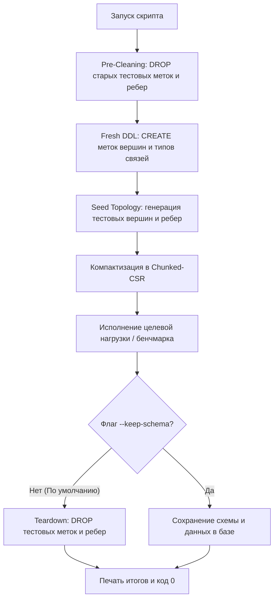

# Руководство по тестированию и бенчмаркингу GDB

Полное руководство по нагрузочному стресс-тестированию, замерам производительности k-hop обходов графа, валидации GPU-ускорения, генерации синтетических данных и математической верификации для распределенной in-memory графовой СУБД **GDB**.

---

## 📑 Содержание
1. [Архитектура тестового набора](#-архитектура-тестового-набора)
2. [Жизненный цикл тестовых схем (Setup & Teardown)](#-жизненный-цикл-тестовых-схем-setup--teardown)
3. [Каталог скриптов и быстрый запуск](#-каталог-скриптов-и-быстрый-запуск)
4. [Стресс-тест высокой конкурентности (`stress_test.py`)](#-стресс-тест-высокой-конкурентности-stress_testpy)
5. [Комплексный бенчмарк аналитики и обходов (`benchmark_suite.py`)](#-комплексный-бенчмарк-аналитики-и-обходов-benchmark_suitepy)
6. [Тестирование аппаратного GPU-ускорения (`gpu_benchmark.py`)](#-тестирование-аппаратного-gpu-ускорения-gpu_benchmarkpy)
7. [Генератор синтетического графа (`data_loader.py`)](#-генератор-синтетического-графа-data_loaderpy)
8. [Математическая валидация 12 алгоритмов (`graph_analytics_validation.py`)](#-математическая-валидация-12-алгоритмов-graph_analytics_validationpy)
9. [Проверка симметричной репликации в кольце (`test_replication.py`)](#-проверка-симметричной-репликации-в-кольце-test_replicationpy)
10. [Метрики Prometheus и мониторинг](#-метрики-prometheus-и-мониторинг)

---

## 🎯 Архитектура тестового набора

Тестовый стек GDB построен на трех ключевых принципах:
1. **Чистый Python (Zero Dependencies)**: Все утилиты и бенчмарки работают исключительно на стандартной библиотеке Python 3 (`urllib.request`, `concurrent.futures`, `json`, `random`, `statistics`). Никаких внешних библиотек и `pip install`.
2. **Изоляция и чистый каталог**: База данных стартует с чистым каталогом. Скрипты автоматически пересоздают необходимые сущности схемы при старте, наполняют граф базовыми данными и **гарантированно удаляют тестовые схемы при завершении работы**.
3. **Аппаратная верификация GPU**: Автоматическое определение бэкенда ускорения — Apple Metal UMA на macOS или NVIDIA CUDA Driver Context на Linux.

---

## 🔄 Жизненный цикл тестовых схем (Setup & Teardown)

Начиная с версии GDB v0.4.1+, СУБД инициализируется с чистым каталогом (без дефолтных меток). Все тестовые скрипты строго следуют единому жизненному циклу:



* **По умолчанию**: Тест не оставляет мусора в базе. По завершении каталог возвращается в исходное чистое состояние.
* **Сохранение данных**: Передайте флаг `--keep-schema`, если вы хотите после теста визуализировать созданный граф в GDB Studio или исследовать через GDB CLI.

---

## 📦 Каталог скриптов и быстрый запуск

| Скрипт | Назначение | Профиль нагрузки | Объекты схемы | Эндпоинт по умолчанию |
| :--- | :--- | :--- | :--- | :--- |
| **[`scripts/stress_test.py`](file:///Users/kirill/Documents/projects/gdb/scripts/stress_test.py)** | Стресс-тест конкурентности и QPS | 25% Writes / 75% Reads | `User`, `Device`, `KNOWS`, `LINKED` | `http://127.0.0.1:8847` |
| **[`scripts/benchmark_suite.py`](file:///Users/kirill/Documents/projects/gdb/scripts/benchmark_suite.py)** | 8-стадийный комплексный бенчмарк | 1-hop, 2-hop, PageRank, Louvain, WCC | `User`, `KNOWS`, `FOLLOWS` | `http://127.0.0.1:8847` |
| **[`scripts/gpu_benchmark.py`](file:///Users/kirill/Documents/projects/gdb/scripts/gpu_benchmark.py)** | Тестирование GPU-ускорения | CSR-вычисления на GPU (>= 10k ребер) | `GpuNode`, `GPU_EDGE` | `http://127.0.0.1:8847` |
| **[`scripts/data_loader.py`](file:///Users/kirill/Documents/projects/gdb/scripts/data_loader.py)** | Загрузка масштабируемого графа | Массовый OLTP-инжест и .gdb батчи | `User`, `FOLLOWS` | `http://127.0.0.1:8847` |
| **[`scripts/graph_analytics_validation.py`](file:///Users/kirill/Documents/projects/gdb/scripts/graph_analytics_validation.py)** | Математическая валидация алгоритмов | 12 эталонных топологий графа | `Node`, `REL` | `http://127.0.0.1:8847` |
| **[`scripts/test_replication.py`](file:///Users/kirill/Documents/projects/gdb/scripts/test_replication.py)** | Тест P2P-репликации в кольце Raft | Симметричная запись через разные ноды | `Device`, `LINKED` | `:8847`, `:8846`, `:8845` |
| **[`scripts/py_client_benchmark.py`](file:///Users/kirill/Documents/projects/gdb/scripts/py_client_benchmark.py)** | Бенчмарк Python SDK & Клиента | Высокоскоростной инжест через Polars | `BenchUser`, `BENCH_KNOWS` | `http://127.0.0.1:8847` |

---

## ⚡ Стресс-тест высокой конкурентности (`stress_test.py`)

Генерирует смешанную транзакционную (OLTP вставки) и аналитическую (OLAP обходы) нагрузку в несколько параллельных потоков, замеряя QPS и перцентили задержек (p50, p90, p95, p99).

### Запуск
```bash
python3 scripts/stress_test.py --endpoint http://127.0.0.1:8847 --concurrency 8 --duration 30
```

### Параметры запуска
* `--endpoint`: HTTP URL ноды (по умолчанию: `http://127.0.0.1:8847`).
* `--concurrency`: Количество параллельных воркеров (по умолчанию: `8`).
* `--duration`: Длительность теста в секундах (по умолчанию: `5`).
* `--write-ratio`: Доля запросов на запись от `0.0` до `1.0` (по умолчанию: `0.25` = 25% записей / 75% чтений).
* `--keep-schema`: Не удалять тестовую схему и данные после завершения.

---

## 📊 Комплексный бенчмарк аналитики и обходов (`benchmark_suite.py`)

Замеряет задержки на 8 ключевых операциях графовой базы данных:
1. **1-Hop Traversal**: `MATCH (a:User)-[:KNOWS]->(b:User) WHERE a.id = $id RETURN b.name`
2. **2-Hop Traversal**: `MATCH (a:User)-[:KNOWS]->(b:User)-[:KNOWS]->(c:User) WHERE a.id = $id RETURN c.name`
3. **PageRank Analytics**: 20 итераций с коэффициентом затухания 0.85
4. **Louvain Community Detection**: Детекция сообществ на основе модулярности
5. **Weakly Connected Components (WCC)**: Поиск компонент связности
6. **Triangle Counting & Clustering**: Подсчет треугольников и коэффициент кластеризации
7. **Single-Source Shortest Path (SSSP)**: Поиск кратчайших путей
8. **Jaccard & Cosine Similarity**: Попарное сходство окрестностей вершин

### Запуск
```bash
python3 scripts/benchmark_suite.py --url http://127.0.0.1:8847 --samples 1000 --concurrency 4
```

---

## 🚀 Тестирование аппаратного GPU-ускорения (`gpu_benchmark.py`)

Специализированный бенчмарк для проверки работы аппаратных GPU-ядер на **Apple Silicon (Metal UMA)** и **NVIDIA GPU (CUDA Driver API)**.

### Запуск
```bash
# 1. Запустить сервер с флагом GPU-ускорения
./bin/gdb-server --enable-gpu &

# 2. Запустить GPU-тест
python3 scripts/gpu_benchmark.py --endpoint http://127.0.0.1:8847 --vertices 10000 --edges 50000 --iterations 5
```

### Что проверяет скрипт:
1. **Статус `/gpu`**: подтверждает активацию бэкенда и модель памяти (UMA Zero-Copy на Mac или CUDA VRAM Scratchpad на Linux).
2. **Превышение порога**: генерирует объем ребер выше порога оффлоада (`--gpu-offload-threshold 10000`).
3. **Компактизация в CSR**: вызывает команду `compact;` для перевода ребер в монолитную Chunked-CSR память.
4. **GPU-вычисления**: замеряет скорость PageRank, WCC, SSSP, Triangle Counting и Louvain, рассчитывая пропускную способность в **ребрах в секунду (edges/sec)**.
5. **Телеметрию**: проверяет метрику `gdb_gpu_active = 1` в Prometheus.

---

## 📥 Генератор синтетического графа (`data_loader.py`)

Генерирует масштабируемые графы социальных связей с безмасштабным распределением степеней вершин (Power-Law preferential attachment).

```bash
# Загрузка 10 000 вершин и 100 000 ребер через REST API
python3 scripts/data_loader.py --url http://127.0.0.1:8847 --vertices 10000 --edges 100000

# Генерация высокоскоростного батч-файла для консоли gdb-cli
python3 scripts/data_loader.py --file data/social_100k.gdb --vertices 10000 --edges 100000

# Удаление загруженных данных и схем
python3 scripts/data_loader.py --url http://127.0.0.1:8847 --teardown
```

---

## 📐 Математическая валидация 12 алгоритмов (`graph_analytics_validation.py`)

Проверяет математическую корректность графовых алгоритмов на эталонных графах:
- **Треугольный клик** (`101 <-> 102 <-> 103`): проверка равенства количества треугольников 1.
- **Звезда** (`200 -> 201..204`): проверка распределения PageRank и степеней вершин.
- **Гантель (Barbell Graph)**: проверка пика Betweenness Centrality на мостовом ребре и корректности разделения сообществ в Louvain.

```bash
python3 scripts/graph_analytics_validation.py --endpoint http://127.0.0.1:8847
```

---

## 🔄 Проверка симметричной репликации в кольце (`test_replication.py`)

Проверяет P2P-репликацию на 3-узловом кластере:
1. Проверяет доступность всех 3 пиров (`:8847`, `:8846`, `:8845`).
2. Объявляет DDL схему через узел #1.
3. Симметрично производит запись данных через разные узлы кольца.
4. Убеждается, что данные сошлись на всех репликах, и аналитические запросы на любом узле возвращают идентичные результаты.

```bash
./scripts/start_cluster.sh
python3 scripts/test_replication.py
```

---

## 🐍 Бенчмарк Python SDK (`py_client_benchmark.py`)

Высокопроизводительный бенчмарк клиентского уровня на базе официального пакета `gdb-client`:
1. **Автоматический жизненный цикл схемы**: Создание `BenchUser` и `BENCH_KNOWS` с автоматическим удалением по завершении (или сохранением при `--keep-schema`).
2. **Пачечная загрузка вершин и ребер**: Замер пропускной способности при групповых вставках через Cypher.
3. **Графовая аналитика и обходы**: Оценка 1-hop и 2-hop обходов, алгоритмов PageRank и Louvain из Python.
4. **Экспорт в NetworkX / Polars**: Проверка прямой конвертации результатов запросов в датафреймы Polars и графы NetworkX.

### Установка зависимостей
Файл зависимостей расположен в папке со скриптами `scripts/requirements.txt`:
```bash
pip install -r scripts/requirements.txt
```

### Запуск
```bash
python3 scripts/py_client_benchmark.py --endpoint http://127.0.0.1:8847 --vertices 5000 --edges 15000 --batch-size 500
```

### Параметры запуска
* `--endpoint`: HTTP REST эндпоинт GDB (по умолчанию: `http://127.0.0.1:8847`).
* `--vertices`: Количество синтетических вершин для генерации (по умолчанию: `5000`).
* `--edges`: Количество синтетических ребер для генерации (по умолчанию: `15000`).
* `--batch-size`: Размер пачки сущностей в одном Cypher-запросе (по умолчанию: `500`).
* `--concurrency`: Число параллельных рабочих потоков (по умолчанию: `4`).
* `--keep-schema`: Сохранить тестовую схему и данные в базе после завершения бенчмарка.

